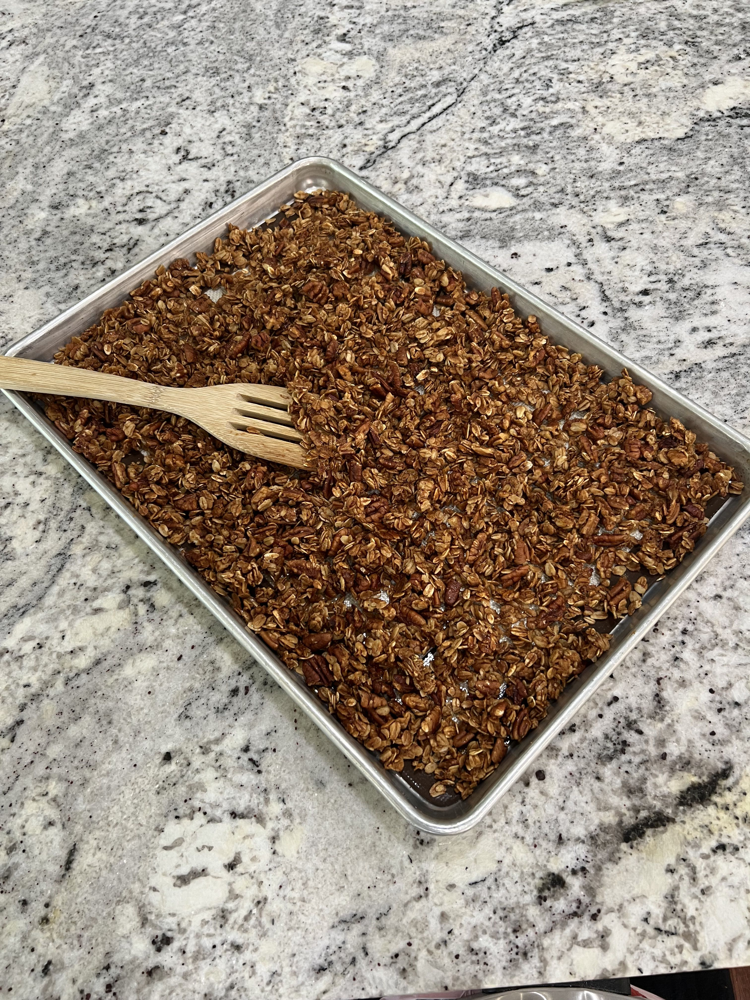
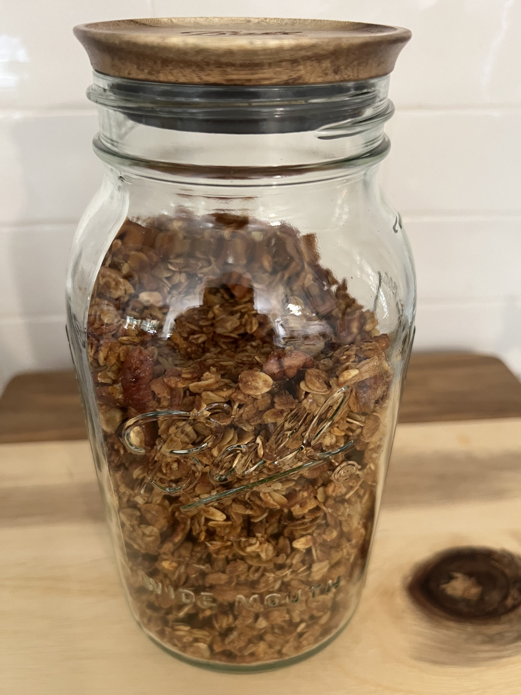

# Homemade Granola

### Ingredients

- 3 cups rolled oats
- 1 tsp cinnamon (more if you like it)
- 1/2 tsp salt
- 2 cups pecan pieces
- 1/3 cup olive oil
- 3/4 cup honey
- 1 Tbsp vanilla extract

### Instructions

- Mix ingredients together in a large bowl.
- Spread on parchment paper lined cookie sheet pan. Shari uses a nonstick silicone baking mat.
- Bake in oven at *300 for 40-45 mins.
- Remove, gently stir, then spread back out on sheet pan.
- Let cool completely before storing in airtight container.
- Crumble it with your hands. If it is still rubbery after it is done cooling, you can put it back in the oven for another 5-10 minutes.
- After it's cooled you can add coconut, chocolate chips, dried raisins, or dried cranberries.